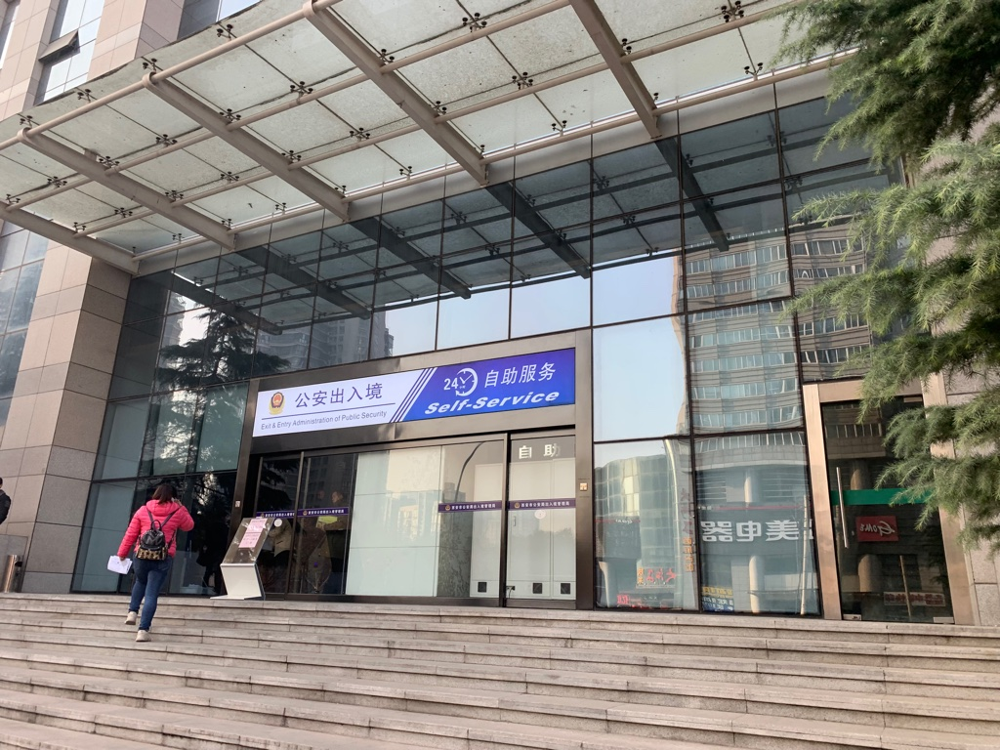
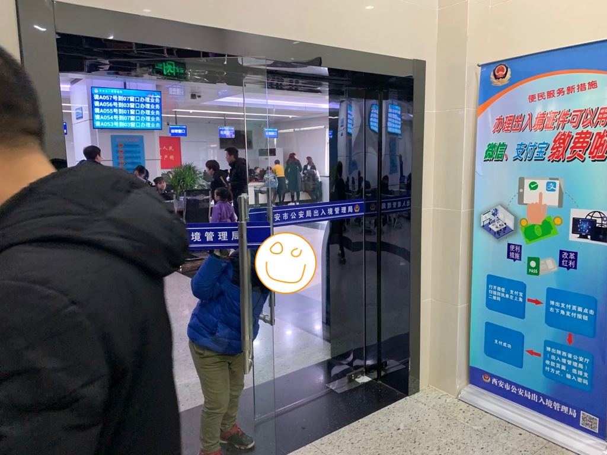
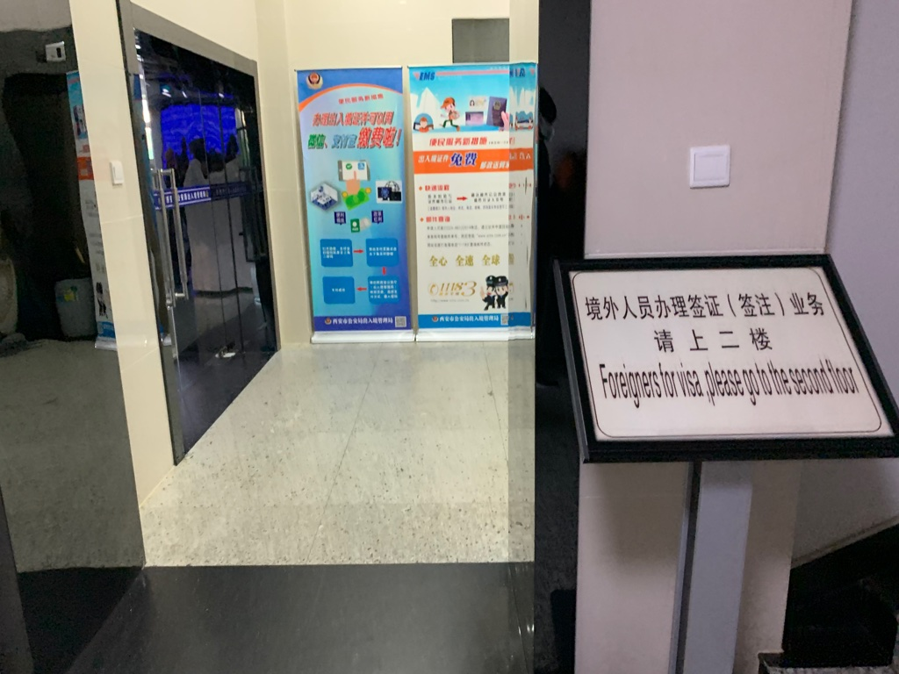

# The PSB (Public Security Bueraru)

## Links
* Baidu Map: http://j.map.baidu.com/abO9Z
* Amap: http://f.amap.com/1vt8F_0836vBB

## By subway
* *From YAN XING MEN:* Go directly to TAI BAI NAN LU station. 
* *From LI JIA CUN:* Go to DA YAN TA and exchange to line 3, then proceed to TAI BAI NAN LU station. 
* TAKE THE **C1** EXIT. 

## By bus 
* Take bus no. 313 from the south gate (same slide). 

## At the PSB 
Facing the PSB from the north side of the building. Go to the smaller entrance on the right. And proceed to the second floor. 

Not this one on the left: 

Not this one on the first floor: 

Just follow this sign: 

